<div align="center">


# VeriTrack AI

**Timesheet screenshots in, verified leave compliance out.**

VeriTrack reads GETS timesheet screenshots with a purpose-built OCR pipeline, proves every number against
the sheet's own totals, and flags any customer-side leave that is missing from the company leave register.


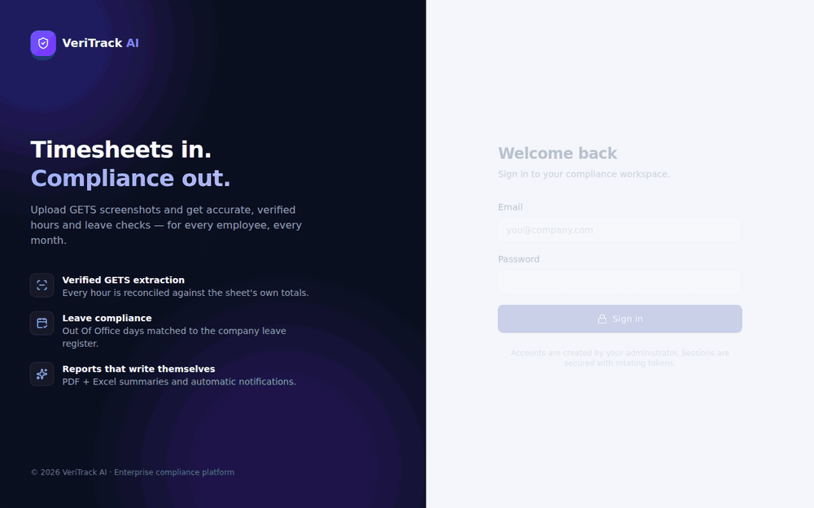

<sub>Upload → OCR with live progress → sheet review (reconstructed, verified grid) → leave analysis. All data shown is synthetic.
Full-quality video: <a href="docs/media/demo.mp4">docs/media/demo.mp4</a></sub>

</div>

---

## Contents

- [Why](#why) · [Features](#features) · [Screenshots](#screenshots)
- [How the OCR works](#how-the-ocr-works) · [Architecture](#architecture)
- [Quality and test results](#quality-and-test-results)
- [Getting started](#getting-started) · [Configuration](#configuration) · [Deployment](#deployment)
- [Roles](#roles-and-permissions) · [Security](#security) · [Project layout](#project-layout) · [Limitations](#known-limitations)

## Why

Every month, managers collect screenshots of each engineer's **GETS** timesheet and check by hand that each
*Out Of Office* day booked with the customer also exists in the company's internal leave register. It is
slow, error-prone, and one misread digit sends the wrong email.

VeriTrack automates the whole loop and is built around one rule: **a number that cannot be proven is never
acted on.**

## Features

| | |
|---|---|
| **Verified OCR** | A geometry-first reader for GETS screenshots. Every hour is cross-checked against row totals, per-hour-type day totals and grand totals; cells the arithmetic pins down are auto-repaired, anything else is flagged *Needs review*. |
| **Leave compliance** | GETS *Out Of Office* days vs. the company leave register (CSV/Excel import or manual entry). Missing days become violations with the exact dates, an email to the employee (Microsoft Graph), and PDF + Excel reports. |
| **Sheet review** | The reconstructed, colour-coded grid (optionally side by side with the uploaded screenshot) and the list of verification checks. |
| **Employee repository** | Versioned master data with inline correction and full history; OCR'd scans of employee lists are supported too. |
| **Built for teams** | Four roles with enforced scoping, audit log of every security-relevant action, analytics per manager. |
| **Fast under load** | Uploads return in milliseconds; OCR runs off the request path with bounded concurrency; API p95 ≈ 110 ms with 50 concurrent users while OCR is saturating the CPU. |
| **Polished UI** | Light/dark themes, command palette (`Ctrl/⌘ K`), collapsible sidebar, mobile layout, live progress, accessible components. |

## Screenshots

| | |
|---|---|
| 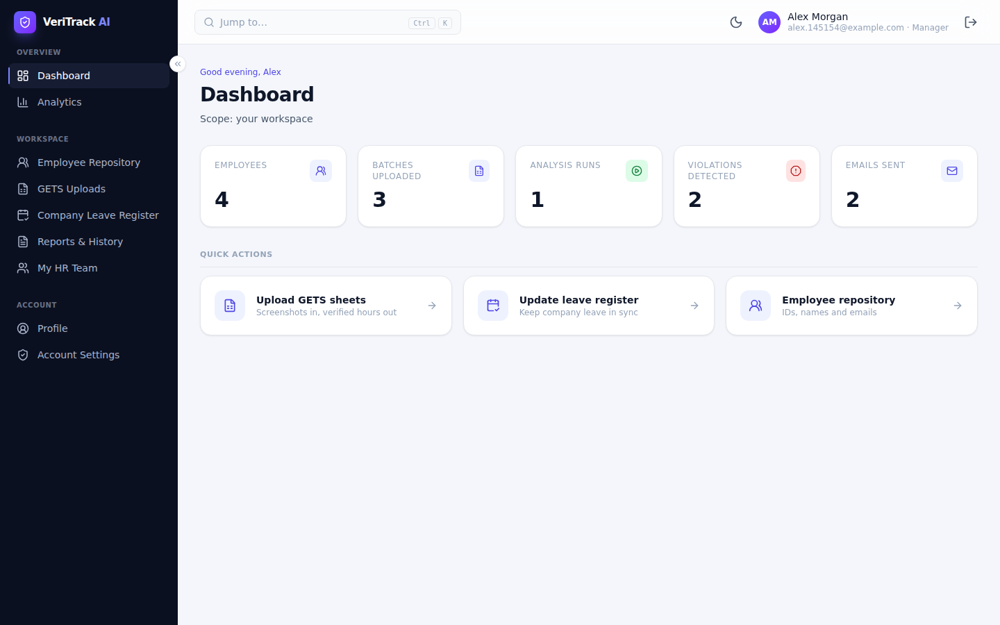 | 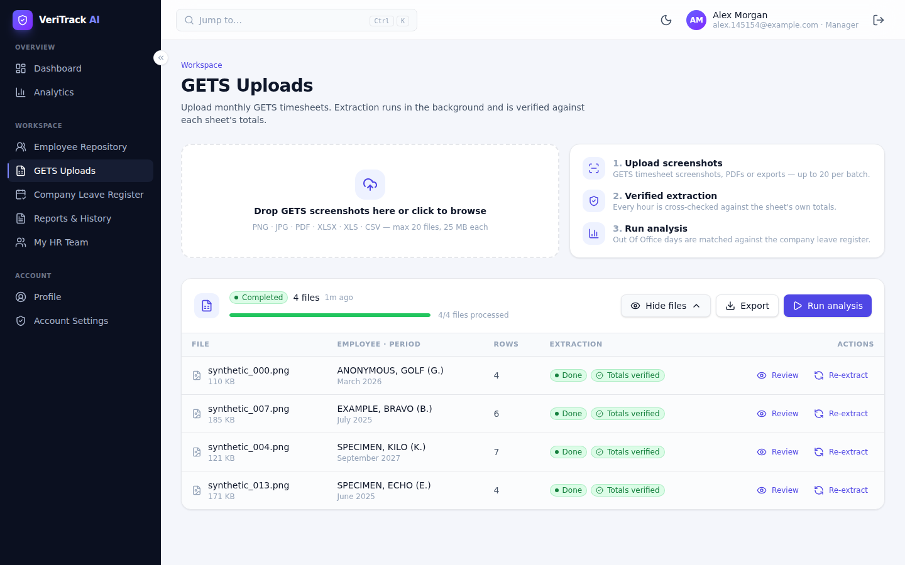 |
| **Dashboard** — role-scoped numbers and quick actions | **GETS uploads** — per-file status, verification and actions |
| 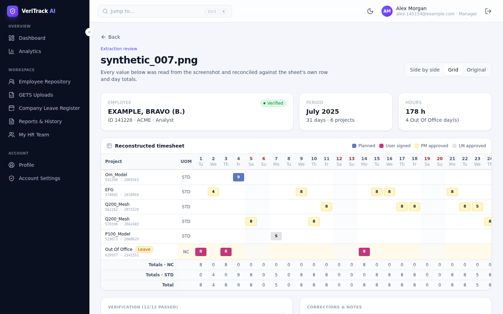 | 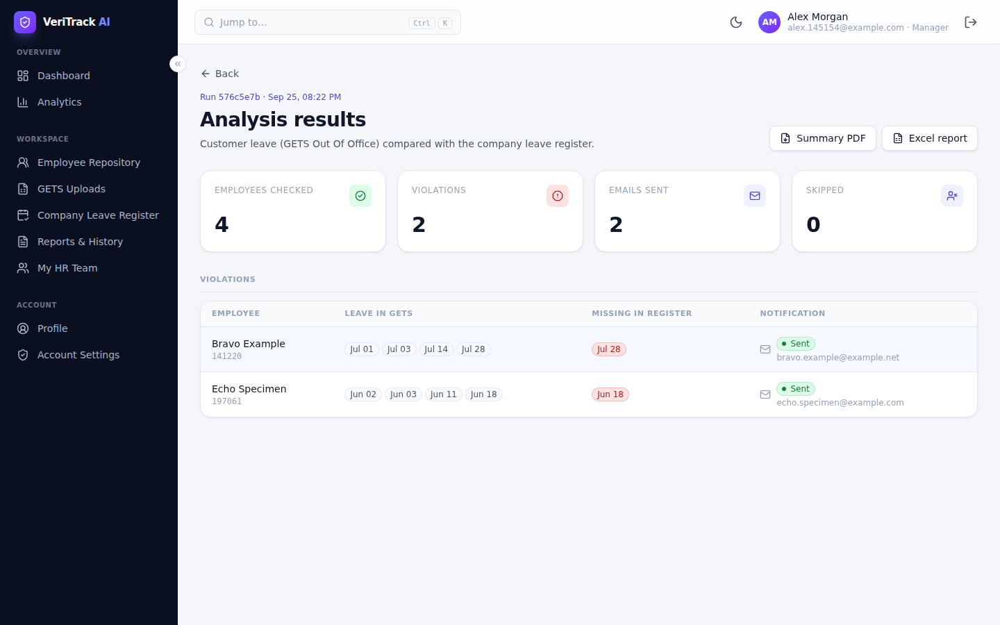 |
| **Sheet review** — reconstructed grid with verification checks | **Analysis** — missing leave days per employee, notification status |
| 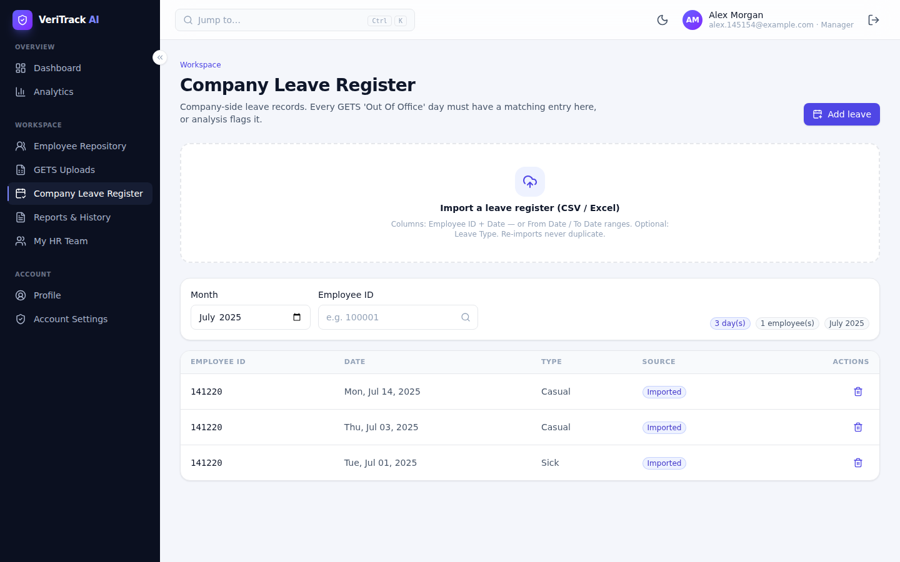 | 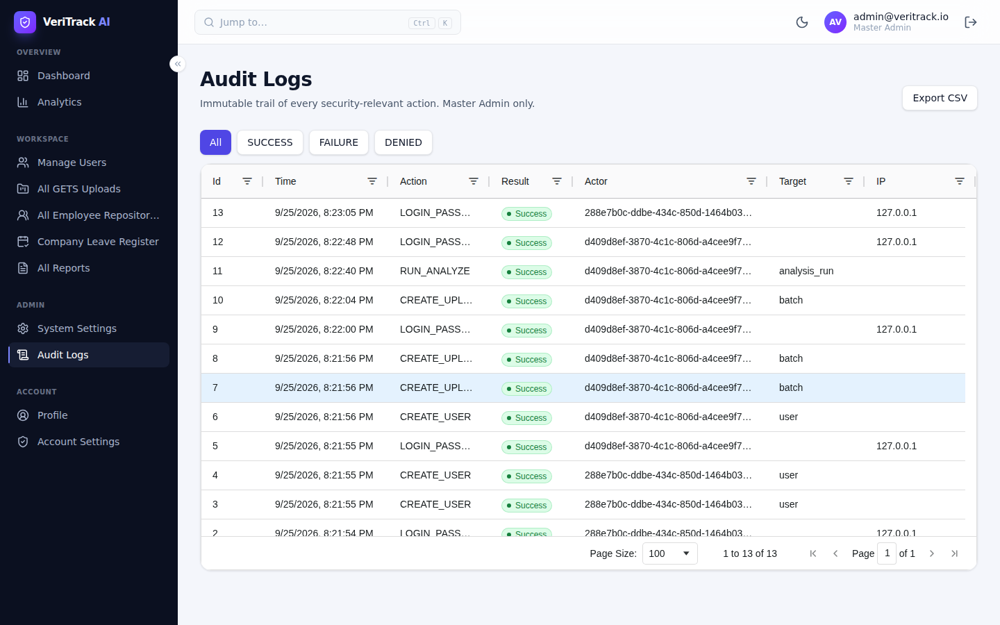 |
| **Company leave register** — import, filter, add, delete | **Audit logs** — filterable, exportable (Master Admin) |
| 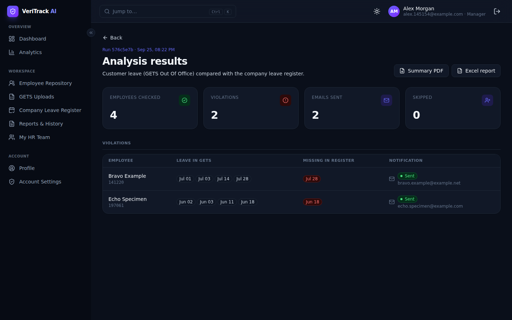 | 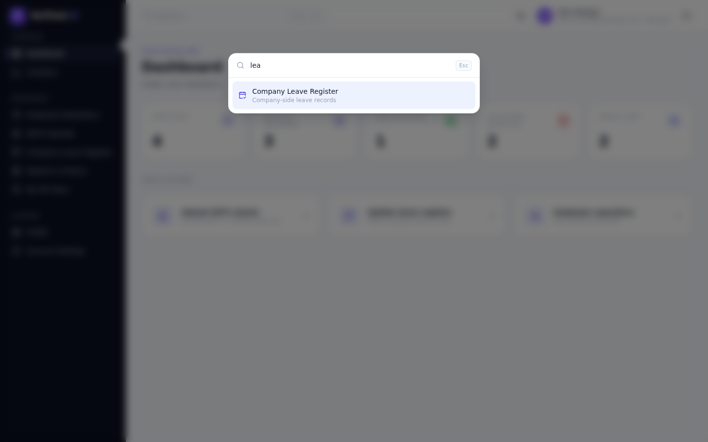 |
| **Dark theme** | **Command palette** |

<details>
<summary>More: login, employee repository, analytics, mobile</summary>

| | |
|---|---|
| 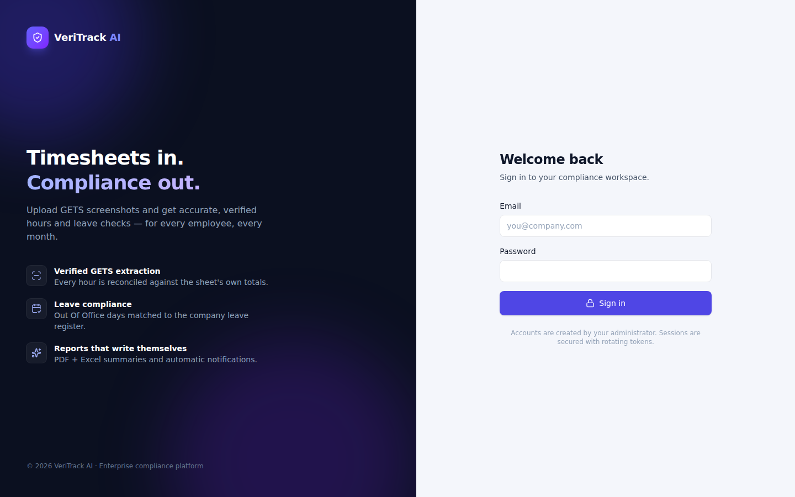 | 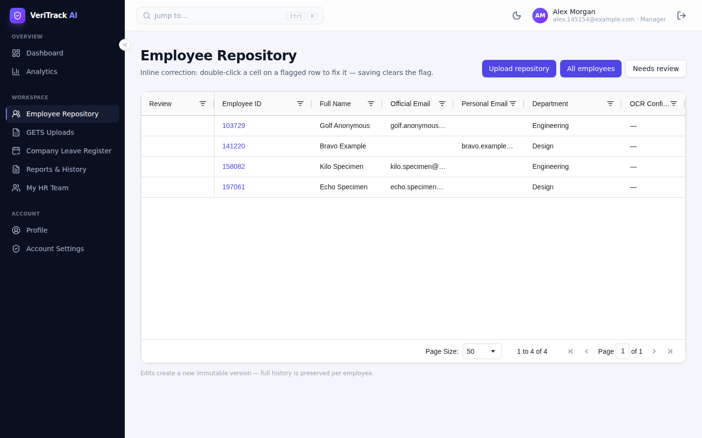 |
| 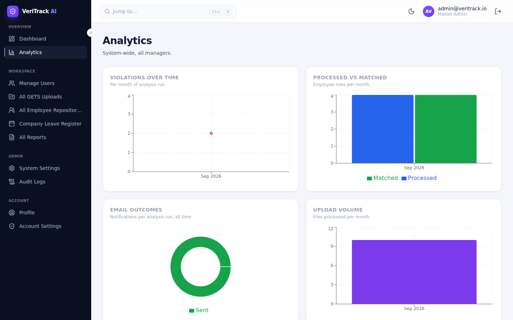 | 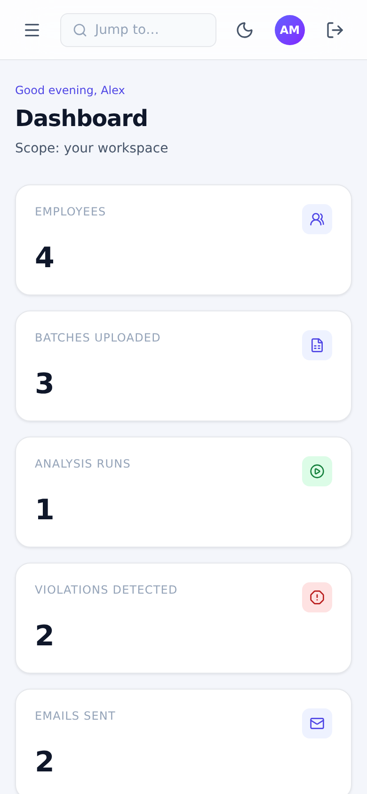 |

</details>

## How the OCR works

Generic OCR reads a timesheet as a cloud of words and loses which number belongs to which day. GETS pages
are rendered by a web app, so their *layout* is regular even when the data is not — the reader exploits that.

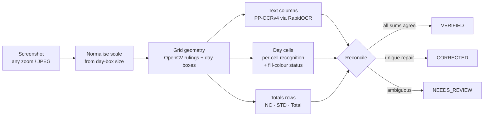

1. **Geometry first.** Day input boxes and table rulings are located with OpenCV, which yields the exact cell
   grid regardless of browser zoom (screens are normalised to a reference box size).
2. **Targeted recognition.** Text columns (Person ID, Supplier, Job Family, UOM, Project, Sub-project) and the
   page header (employee, month, year) are read with PP-OCRv4; each inked day cell is recognised on its own
   crop and its fill colour classified as *User Signed / PM Approved / LM Approved / Planned*.
3. **Proof by arithmetic.** Every value is checked against the row total, the per-hour-type day totals and the
   grand total. A cell the equations determine uniquely is repaired and reported; an unreadable hour type is
   resolved the same way. Anything else — and any sheet whose totals rows or month are missing — is
   *Needs review* and is never emailed.

## Architecture

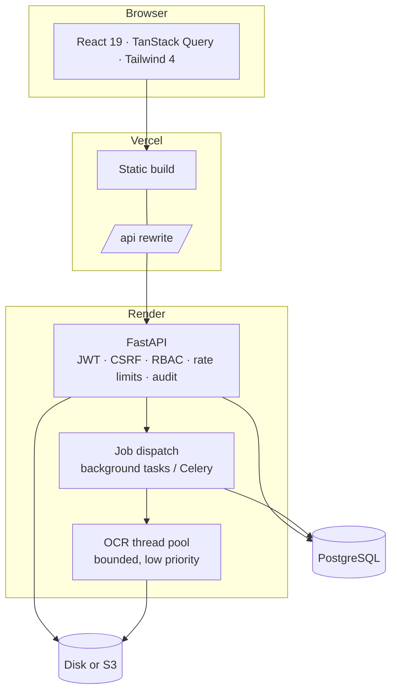

**Design decisions**

- **Same-origin API.** Vercel proxies `/api/*` to Render, so the refresh cookie is first-party
  (`SameSite=Strict`) and no CORS preflights are needed.
- **Never block the event loop.** OCR, PDF/Excel generation, password hashing and storage I/O run in worker
  threads; OCR has its own pool sized by `OCR_CONCURRENCY` at lowered CPU priority, so requests stay fast
  while scans are processed. No database connection is held while a file waits for or runs OCR.
- **Exactly-once processing.** Files, batches and analyses are claimed with atomic status transitions
  (`UPDATE … WHERE status … RETURNING`) and a unique run per batch: double clicks, retries and multiple
  replicas can never process twice. Interrupted batches and analyses resume on startup.
- **Stateless API.** Short-lived access tokens, rotating refresh tokens with reuse detection (and a 30 s grace
  window so parallel browser tabs don't log each other out). Scale out by adding instances.

## Quality and test results

Everything below runs in this repository against real PostgreSQL. No real employee data is committed; the
OCR suites use synthetic sheets with invented people and projects, rendered on demand by `scripts/gen_synthetic_gets.py` (they are never committed).

| Suite | What it proves | Result |
|---|---|---|
| **Backend** (`pytest tests`) | API, auth, rules, OCR, concurrency, recovery, exports, migrations | **283 passed** (+ 32 private real-sheet checks) |
| &nbsp;&nbsp;OCR accuracy | 16 synthetic sheets (28–31-day months, 1–9 projects, 4 fonts, 90–150 % zoom) read field-for-field | **16/16 exact** |
| &nbsp;&nbsp;Capture conditions | 4 sheets × 7 degradations (80–200 % zoom, JPEG q60, blur, noise): every hour, total, status, ID and period | **28/28 exact** |
| &nbsp;&nbsp;Hostile inputs | cropped totals, cut-off columns, rotation, grayscale, tiny, padded: exact *or* flagged — never verified-and-wrong | **7/7** |
| &nbsp;&nbsp;Permission matrix | all 42 endpoints × 4 roles + anonymous; cross-manager access to every object type | **0 leaks** |
| **Frontend** (`npm test`) | pages, guards, flows, shell | **49 passed** |
| **End-to-end** (`pytest e2e`, real Chromium) | every page and button for all four roles, uploads, downloads, dark mode, palette, mobile, negative paths; fails on any console error or 5xx | **48 passed**, stable across consecutive runs, also against the production build |
| **Load** (`scripts/load_test.py`, production mode, 2 vCPU) | 50 concurrent users: 40 managers upload → OCR → analyse while 10 HR users browse continuously | **40/40 results correct, 0 errors, 0 cross-user leaks** |

Latency during the load test (≈ 38 000 requests, OCR saturating the CPU the whole time):

| Endpoint | p50 | p95 |
|---|---|---|
| Dashboard / lists | 23–30 ms | 82–114 ms |
| Analysis trigger / result | 27–30 ms | 133–273 ms |
| GETS upload (stored + queued) | 0.54 s | 2.1 s |
| Login, 50 users in the same second | 7 s | 10.5 s |

The login burst is bcrypt (cost 12) competing for 2 vCPUs — deliberate slowness that protects passwords; it
scales with CPU count and is a one-off per session (sessions refresh silently for 7 days).

The reader was also validated privately on the original company sheets: **4 sheets × 8 capture conditions,
32/32 exact** (drop them in the git-ignored `private-data/gets/` to re-run that check).

## Getting started

**Prerequisites:** Python 3.12, Node 22, PostgreSQL 14+ (or Docker).

```bash
# backend
python -m venv .venv && .venv/bin/pip install -r requirements-dev.txt
cp .env.example .env                        # set SEED_ADMIN_PASSWORD
createdb veritrack                          # or: docker compose up -d db
.venv/bin/alembic upgrade head
.venv/bin/python -m app.cli create-master-admin
.venv/bin/uvicorn app.main:app --reload     # http://localhost:8000/docs

# frontend
cd frontend && npm ci && npm run dev        # http://localhost:5173
```

Or run the whole stack in containers: `docker compose up --build` → <http://localhost:8080>.

## Configuration

All settings are environment variables (see [`.env.example`](.env.example)); production refuses insecure values.

| Variable | Purpose |
|---|---|
| `ENVIRONMENT` | `production` enables strict validation, secure cookies, HSTS and hides `/docs` |
| `DATABASE_URL` | PostgreSQL URL (`postgres://…` from hosting providers is accepted) |
| `JWT_SECRET_KEY` | ≥ 32 random characters |
| `CORS_ORIGINS` | explicit origins only (not needed with the Vercel rewrite) |
| `PROCESSING_MODE` | `background` (default) · `celery` (Redis + workers) · `inline` (tests) |
| `OCR_CONCURRENCY` | sheets read in parallel per API process (≈ CPU cores) |
| `TRUSTED_PROXY_HOPS` | proxies in front of the API (`2` for Vercel → Render) — used for rate limits and the audit log |
| `STORAGE_BACKEND` | `local` · `volume` (persistent disk) · `s3` |
| `OUTBOUND_EMAIL_MODE` | `dry_run` (default, records only) · `live` with `GRAPH_*` credentials |
| `M365_*` | optional Microsoft Entra ID single sign-on |

## Deployment

Frontend on **Vercel**, API + PostgreSQL on **Render** — step by step in [docs/DEPLOYMENT.md](docs/DEPLOYMENT.md).

1. Render → **New → Blueprint** → this repository (`render.yaml` creates the API, the database and a disk).
   Set `SEED_ADMIN_EMAIL`, `SEED_ADMIN_PASSWORD`, `CORS_ORIGINS`.
2. Put the Render URL into [`vercel.json`](vercel.json) (`rewrites`).
3. Vercel → **Import** this repository (root directory = repository root).

## Testing

```bash
createdb veritrack_test
.venv/bin/playwright install chromium                       # renders the synthetic GETS test sheets
.venv/bin/python -m pytest -q tests                         # backend: ~12 min, includes OCR accuracy
cd frontend && npm test && npm run lint && npx tsc -b       # frontend
# end-to-end (needs the API on :8000 and `npm run dev` or `npm run preview`)
E2E_ADMIN_EMAIL=... E2E_ADMIN_PASSWORD=... .venv/bin/python -m pytest e2e -q
# load test against a running API
ADMIN_EMAIL=... ADMIN_PASSWORD=... .venv/bin/python -m scripts.load_test --managers 40 --hr 10
# OCR accuracy report, optionally on your own sheets
.venv/bin/python -m scripts.eval_gets_accuracy --variants [--dir private-data/gets]
```

CI (`.github/workflows/ci.yml`) runs lint, the backend suite against PostgreSQL, and the frontend type-check,
lint, tests and build on every push and pull request.

## Roles and permissions

| Role | Can |
|---|---|
| **Master Admin** | manage users, system settings and SSO domains, audit logs; see every manager's data |
| **Executive** | analytics, every repository and report, manager & HR directory |
| **Manager** | upload GETS sheets, repositories and leave registers; run analyses; reports; create HR accounts |
| **HR** | read-only access to their manager's employees, GETS exports and leave register |

The route guard and the API enforce the same table; `tests/test_permission_matrix.py` fails if an endpoint
is added without a permission decision.

## Security

- Passwords hashed with bcrypt (cost 12, off the event loop); account lockout with no lockout oracle.
- Access JWT (15 min) + rotating refresh cookie (`HttpOnly`, `Secure`, `SameSite=Strict`) with reuse
  detection; CSRF double-submit token on cookie-authenticated endpoints.
- Rate limits per client address (resolved from a trusted proxy chain, so `X-Forwarded-For` cannot be forged)
  and per user for expensive endpoints.
- Uploads validated by magic bytes and size; CSV/Excel exports neutralise formula injection.
- Security headers (HSTS, `nosniff`, `DENY` framing, referrer policy); `/docs` disabled in production.
- Audit log for logins, user changes, uploads, analyses, exports and settings.

## Project layout

```
app/
  api/routers/        auth, users, uploads, employees, leaves, analysis, dashboard, analytics, audit, health
  services/           analysis rules, leave register, jobs, reporting, email, storage, …
    extraction/       readers, normalisation, pipeline, gets_grid (GETS reader), generic_table (other scans)
  core/ db/ models/ schemas/
alembic/              migrations
frontend/             React app — pages, layouts, UI kit, tests
e2e/                  real-browser suite (Playwright)
scripts/              load test, OCR accuracy report, synthetic sheet generator, README media capture
test-data/           synthetic GETS sheets are generated here on demand (git-ignored)
tests/                backend suite
docs/                 deployment guide, screenshots, demo video
```

## Known limitations

- The GETS reader is specialised for the GETS *Time Sheet* page; other scans go through a generic table reader
  and are flagged for review more often.
- Free-text labels (names, sub-project titles) can pick up small OCR slips on heavily degraded images; they are
  informational — the leave rule keys on person ID, hour type and dates, which are verified.
- Processing a batch is sequential per batch (fair across managers); a single very large batch takes
  ~6–10 s per sheet per OCR slot.
- Microsoft 365 sign-in and live e-mail need an Entra ID app registration and were exercised in dry-run mode.

## License

[MIT](LICENSE)
